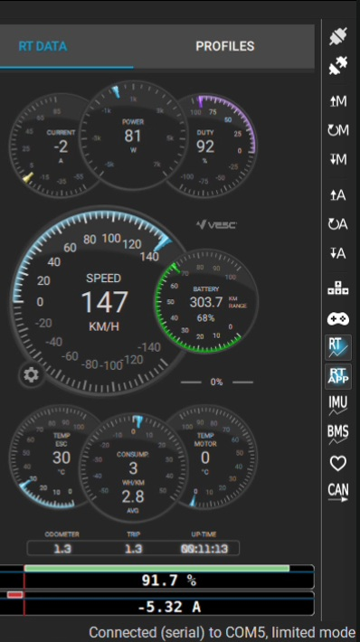

# Progetto Interfaccia VESC Avanzata: Arduino/ESP32, UART, Bluetooth e Display

Questo repository, curato da Ruggero Cadamuro, descrive un progetto versatile per interfacciare Controllori Elettronici di Velocità (VESC) compatibili UART con microcontrollori come **Arduino Pro Micro** (ATmega32u4) o, più potentemente, **ESP32**. L'obiettivo è leggere i dati dal VESC, elaborarli e renderli disponibili tramite **Bluetooth (BLE)** usando un modulo ESP32 (come l'ESP32-C3 o integrato) e/o visualizzarli su un **display dedicato** collegato a un ESP32 (come l'ESP32-2432S028R).

Questo permette il monitoraggio in tempo reale, la registrazione dei dati, il controllo remoto o la creazione di dashboard personalizzate per veicoli elettrici (e-skate, e-bike, ecc.).

## 🎯 Obiettivi Principali:

*   **Interfacciamento VESC:** Stabilire una comunicazione robusta via UART con qualsiasi VESC compatibile.
*   **Elaborazione Dati:** Leggere, interpretare e potenzialmente filtrare/elaborare i dati telemetrici del VESC (velocità, RPM, corrente, tensione, temperature, ecc.).
*   **Connettività Bluetooth:** Utilizzare un ESP32 per fornire un ponte Bluetooth Low Energy (BLE), consentendo la connessione con app per smartphone (come VESC Tool Mobile,
    Your's Truly, etc.) o altri dispositivi BLE per monitoraggio e configurazione wireless.
*   **Visualizzazione su Display:** Implementare un display (basato su ESP32, es. ESP32-2432S028R) per mostrare i dati VESC in tempo reale con un'interfaccia utente personalizzabile.

## ✨ Caratteristiche Implementate / Possibili:

*   🔌 **Comunicazione Seriale Hardware con VESC:** Utilizzo della porta UART (TX/RX) del microcontrollore (Arduino o ESP32) per lo scambio dati e comandi con il VESC.
*   📡 **Connettività Bluetooth (BLE) via ESP32:** Integrazione di un ESP32 per gestire la comunicazione BLE, agendo da ponte tra VESC (UART) e dispositivi mobili/remoti.
*   📺 **Display VESC Dedicato (Implementazione ESP32-2432S028R):**
    *   Visualizzazione in tempo reale di velocità, RPM, potenza.
    *   Calcoli ottimizzati simili a quelli del VESC Tool.
    *   Tracciamento della distanza percorsa (parziale e totale).
    *   Memorizzazione dei dati di viaggio su EEPROM.
    *   Controllo automatico della luminosità tramite sensore LDR.
    *   Avvisi per surriscaldamento e batteria scarica.
    *   Supporto per immagini PNG per sfondi UI e logo di avvio personalizzati.
*   💡 **Flessibilità:** Adattabile a diversi modelli di VESC con protocollo UART standard.
*   📊 **Filtraggio Dati (Opzionale):** Possibilità di usare filtri (es. Kalman) per "lisciare" letture rumorose (es. corrente).

## 🎨 Demo (Implementazione Display ESP32-2432S028R)



## 🛠️ Hardware Utilizzato / Consigliato:

*   **Controller VESC:** Qualsiasi modello con interfaccia UART abilitata.
*   **Microcontrollore Principale:**
    *   **Opzione 1 (Bridge Semplice):** Arduino Pro Micro (ATmega32u4) + Modulo ESP32-C3 (per BLE).
    *   **Opzione 2 (Display/Bridge Integrato):** ESP32 (es. modulo ESP32 Dev Kit C, o scheda con display integrato come **ESP32-2432S028R**).
*   **Sensori (Opzionale per Display):** Sensore di luce LDR per luminosità automatica.
*   **Cavi e Connettori:** Per collegare VESC, microcontrollore, eventuale display e alimentazione.

## 📚 Librerie e Codici di Riferimento Utilizzati:

Questo progetto si basa su e trae ispirazione dalle seguenti eccellenti risorse:

*   **Comunicazione VESC:**
    *   **VescUart (per Arduino):** [https://github.com/SolidGeek/VescUart](https://github.com/SolidGeek/VescUart) - Libreria robusta per Arduino.
    *   **ComEVesc (per ESP32 Display):** Libreria specifica usata nell'implementazione display.
*   **Filtraggio:**
    *   **SimpleKalmanFilter:** [https://github.com/denyssene/SimpleKalmanFilter](https://github.com/denyssene/SimpleKalmanFilter) - Utile per migliorare la stabilità delle letture.
*   **Display (per ESP32-2432S028R):**
    *   **TFT_eSPI:** [https://github.com/Bodmer/TFT_eSPI](https://github.com/Bodmer/TFT_eSPI) - Controllo del display TFT. **Richiede configurazione specifica per ESP32-2432S028R nel file User_Setup.h o User_Setup_Select.h.**
    *   **FlickerFreePrint:** Per rendering del testo senza sfarfallio.
    *   **PNGdec:** [https://github.com/bitbank2/PNGdec](https://github.com/bitbank2/PNGdec) - Decodifica immagini PNG.
*   **Memoria:**
    *   **EEPROMAnything:** Per salvataggio dati su EEPROM (utile per trip/distanza).
*   **Ispirazione e Basi:**
    *   **VescBLEBridge:** [https://github.com/A-Emile/VescBLEBridge](https://github.com/A-Emile/VescBLEBridge) - Ispirazione per il ponte BLE VESC <-> ESP32.
    *   **VESC LCD EXAMPLE:** [https://github.com/TomStanton/VESC_LCD_EBIKE](https://github.com/TomStanton/VESC_LCD_EBIKE) - Esempi gestione dati VESC.
    *   **Simple VESC Display (SVD):** [https://github.com/Gh0513d/SVD](https://github.com/Gh0513d/SVD) - Progetto originale su cui si basa l'implementazione del display per ESP32-2432S028R.

## 📥 Installazione (Esempio per ESP32 Display - ESP32-2432S028R)

1.  **Installa Arduino IDE e Supporto ESP32:**
    *   Scarica e installa l'ultima versione di [Arduino IDE](https://www.arduino.cc/en/software).
    *   Aggiungi l'URL del Board Manager ESP32 nelle Preferenze:
        ```
        https://raw.githubusercontent.com/espressif/arduino-esp32/gh-pages/package_esp32_index.json
        ```
    *   Installa il pacchetto "ESP32" tramite il Gestore Schede.

2.  **Installa le Librerie Necessarie:**
    *   Il modo più semplice è estrarre il file `libraries.zip` (se fornito nel repository specifico dell'implementazione display) nella cartella delle librerie di Arduino (`Documenti/Arduino/libraries/`).
    *   Alternativamente, installa manualmente tramite il Library Manager o scaricando i file ZIP: TFT_eSPI, FlickerFreePrint, ComEVesc (o VescUart se si usa Arduino), PNGdec, EEPROMAnything, SimpleKalmanFilter (se usato).
    *   **IMPORTANTE per TFT_eSPI:** Devi configurare correttamente la libreria per il tuo display ESP32-2432S028R. Modifica il file `User_Setup_Select.h` nella cartella della libreria TFT_eSPI commentando la linea `#include <User_Setup.h>` e decommentando la linea corrispondente al tuo display (spesso è `#include <User_Setups/Setup25_TTGO_T_Display.h>` o una specifica per il modello 2432S028R se presente, oppure crea un setup personalizzato).

3.  **Carica il Codice sull'ESP32:**
    *   Apri il file `.ino` del progetto (es. `vesc_display.ino` per l'implementazione display) nell'IDE Arduino.
    *   Seleziona la scheda corretta: **ESP32 Dev Module** (o una più specifica se disponibile).
    *   Imposta la **Porta COM** corretta.
    *   Configura i parametri della scheda (Partition Scheme, ecc.) se necessario.
    *   Clicca su **Carica** (Upload).

## 🔧 Configurazione

Prima della compilazione, potresti aver bisogno di aggiustare alcuni parametri nel codice sorgente (`.ino`):

*   **Parametri Motore/Veicolo:** Imposta correttamente `MOTOR_POLE_PAIRS`, `WHEEL_DIAMETER`, `MOTOR_PULLEY_TEETH`, `WHEEL_PULLEY_TEETH` per calcoli accurati di velocità e distanza.
*   **Pin UART:** Assicurati che i pin RX/TX definiti nel codice corrispondano a come hai collegato il VESC all'ESP32/Arduino.
*   **Configurazione TFT_eSPI:** (Vedi sezione Installazione).

## 🚀 Prossimi Sviluppi / Idee Future:

*   🎨 Migliorare le opzioni di personalizzazione dell'interfaccia utente (possibilmente usando librerie grafiche più avanzate come LVGL).
*   🌐 Completare/Ottimizzare il bridge BLE e WiFi per una connettività più robusta.
*   📊 Migliorare la registrazione e la visualizzazione dei dati (es. grafici).
*   🔗 Aggiungere il supporto **CANBUS** per una comunicazione alternativa e potenzialmente più affidabile con il VESC (se supportato dal VESC e dal microcontrollore).

## 🙏 Ringraziamenti e Crediti:

Desidero esprimere la mia sincera gratitudine agli autori e ai contributori delle librerie e dei codebase menzionati, senza i quali questo progetto non sarebbe stato possibile:

*   **SolidGeek:** Per la libreria **VescUart**, fondamentale per la comunicazione Arduino-VESC.
*   **denyssene:** Per la libreria **SimpleKalmanFilter**, utile per il filtraggio dei dati.
*   **A-Emile:** Per il codice **VescBLEBridge**, fonte d'ispirazione per la parte Bluetooth.
*   **TomStanton:** Per il **VESC LCD EXAMPLE**, utile per capire la gestione dei dati VESC.
*   **Gh0513d:** Per il progetto originale **Simple VESC Display (SVD)**, base dell'implementazione per ESP32-2432S028R.
*   **Bodmer:** Per l'indispensabile libreria **TFT_eSPI**.
*   **bitbank2:** Per la libreria **PNGdec**.
*   **Tutti i contributori** ai progetti menzionati e alla comunità open-source ESP32/Arduino/VESC.

Il vostro lavoro è molto apprezzato!

**Autore (Combinazione e Adattamenti):** Ruggero Cadamuro

## 📜 Licenza:

Questo progetto è rilasciato sotto la **Licenza MIT**. Vedi il file `LICENSE` per maggiori dettagli.

## 📞 Contatti e Supporto:

Per qualsiasi domanda, problema o supporto relativo a questo progetto, puoi contattarmi tramite WhatsApp: [http://wa.link/jsfvei](http://wa.link/jsfvei)

---

